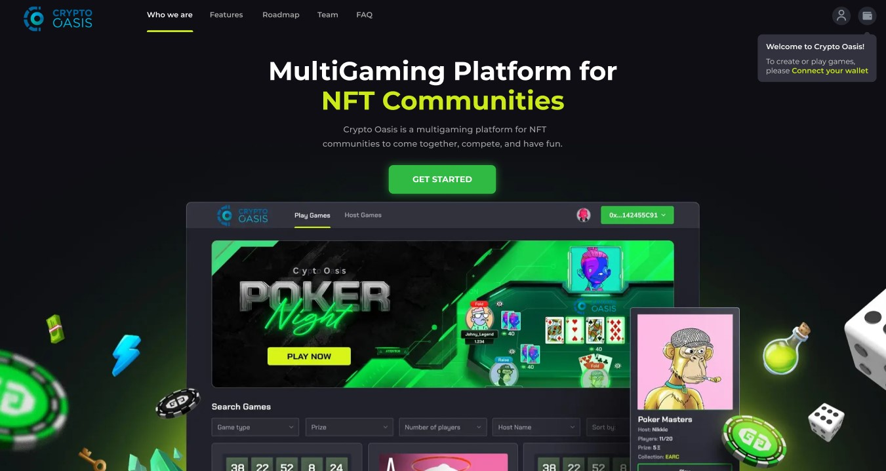
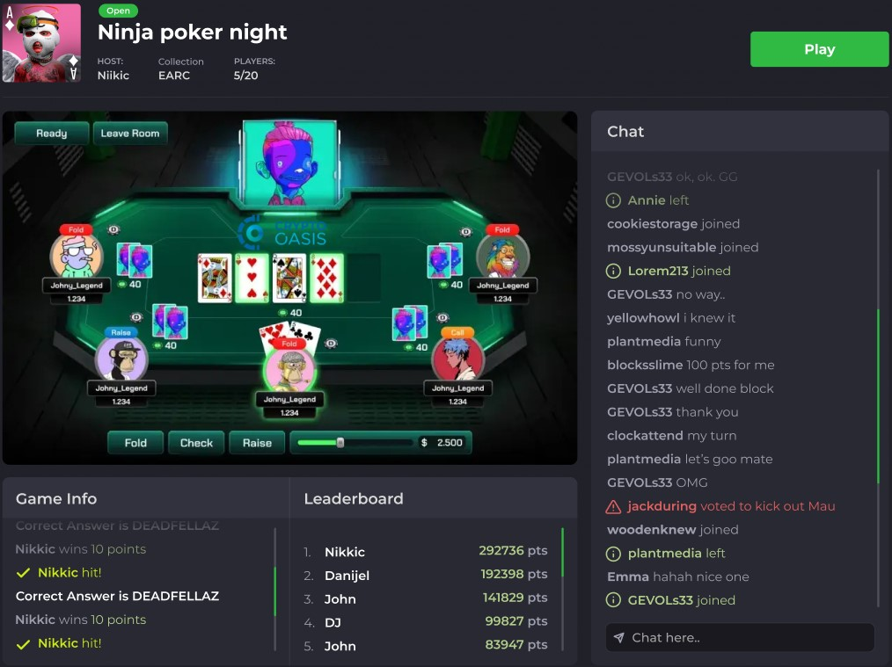
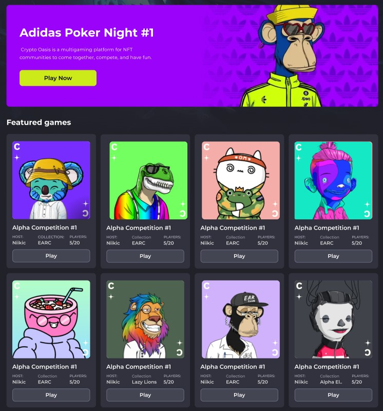

# DMCC(Dubai Multi Commodities Centre)-Socifi MVP-v2


## - User Authentication: Secure login and registration for players.



## - Multiplayer Functionality: Join and play at virtual tables with other players.
## - Real-time Gameplay: Interactive gameplay with real-time updates using WebSockets.



## - Multiple Game Modes: Play different styles of poker.
## - Chat System: Communicate with other players during gameplay through a chat interface.
## - Responsive Design: Optimized for both desktop and mobile devices for a cross-platform experience.



### Install server dependencies

```bash
npm install
```

### Install client dependencies

```bash
cd client
npm install
```

### Run project

```bash
npm start
```